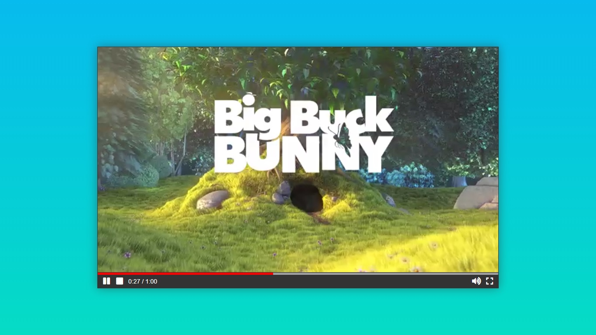

# HTML5 Video Player on ReactJS


## Description
Frontend React JS Application that represents HTML5 Video API.

Live Demo [here](https://).

### TODO List
* Correct FullScreen mode support;
* Add more API features/actions;
* Write Unit Tests;
* Write E2E Tests.

## Getting Started
Application is made with [React](https://reactjs.org/) and use [SASS](https://sass-lang.com/) grade CSS extension language.

### Preparation
Download and install latest version of [NodeJS](https://nodejs.org/) if you don't have one yet.

### Installation
Clone the repo

```bash
git clone https://github.com/mst-crew-dev/react-video-player.git
```

Go into the app directory

```bash
cd react-video-player
```

Install all dependent modules

```bash
npm install
```

### Running
Start the React App
```bash
npm start
```

## License
### The MIT License (MIT)

Permission is hereby granted, free of charge, to any person obtaining a copy of this software and associated documentation files (the "Software"), to deal in the Software without restriction, including without limitation the rights to use, copy, modify, merge, publish, distribute, sublicense, and/or sell copies of the Software, and to permit persons to whom the Software is furnished to do so, subject to the following conditions:

The above copyright notice and this permission notice shall be included in all copies or substantial portions of the Software.

THE SOFTWARE IS PROVIDED "AS IS", WITHOUT WARRANTY OF ANY KIND, EXPRESS OR IMPLIED, INCLUDING BUT NOT LIMITED TO THE WARRANTIES OF MERCHANTABILITY, FITNESS FOR A PARTICULAR PURPOSE AND NONINFRINGEMENT. IN NO EVENT SHALL THE AUTHORS OR COPYRIGHT HOLDERS BE LIABLE FOR ANY CLAIM, DAMAGES OR OTHER LIABILITY, WHETHER IN AN ACTION OF CONTRACT, TORT OR OTHERWISE, ARISING FROM, OUT OF OR IN CONNECTION WITH THE SOFTWARE OR THE USE OR OTHER DEALINGS IN THE SOFTWARE.
